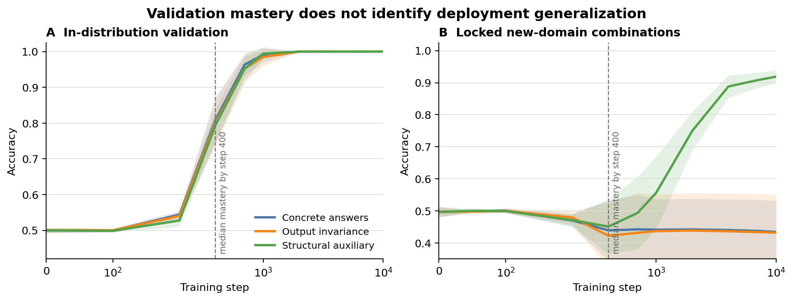

# Principle Reuse

**Training beyond benchmark mastery**

Models that perform identically on familiar validation data can still learn
very different solutions. This repository studies whether training produces a
shared internal relation that can be reused across new renderings, domain
combinations, and latent cases—not merely whether the model returns correct
answers on the distribution used to establish mastery.



## Main result

The completed V2 experiment trained 324 small transformers in a fully crossed
design:

- three objectives: concrete answer supervision, output invariance, and
  structural auxiliary supervision;
- two weight-decay levels;
- three evidence-difficulty regimes;
- three model widths; and
- six paired random seeds.

All objective groups reached identical endpoint in-distribution validation
accuracy and Brier skill. They diverged sharply on an independently locked
deployment evaluation:

| Endpoint accuracy | Concrete | Output invariant | Structural auxiliary |
|---|---:|---:|---:|
| In-distribution validation | 1.000 | 1.000 | 1.000 |
| New domain combination | 0.434 | 0.432 | 0.919 |
| New latent relation | 0.837 | 0.841 | 0.916 |
| Both shifts | 0.465 | 0.455 | 0.865 |

The registered structural-auxiliary versus concrete contrast on new domain
combinations was +0.485 accuracy (six-seed 95% t interval: +0.387 to +0.583).
All six seed contrasts were positive, as were 107 of 108 matched factorial
cells. The difference developed primarily after ordinary validation mastery and
was accompanied by transferred latent probes, rank-axis alignment, and a much
higher rate of valid causal interchange measurements.

Structural auxiliary supervision supplies privileged information and is a
positive-control intervention, not evidence of spontaneous abstraction or a
general solution to alignment. The result establishes a narrower point:
benchmark mastery does not identify the reusable organization produced by
training.

## Reproduce the released analysis

The analysis uses the committed checkpoint-level results and does not require a
GPU or PyTorch.

```bash
python3 -m venv .venv
source .venv/bin/activate
pip install -r requirements-analysis.txt

python -m experiments.training_axes.task
python -m experiments.training_axes.analyze_locked_v2
python -m experiments.training_axes.plot_v2
```

These commands regenerate:

- `experiments/training_axes/v2_locked_cells.csv`;
- `experiments/training_axes/v2_locked_contrasts.json`;
- `experiments/training_axes/V2_LOCKED_REPORT.md`; and
- `assets/v2_overview.png` and `assets/v2_overview.pdf`.

See [REPRODUCING.md](REPRODUCING.md) for the end-to-end training and locked-test
workflow. See [DATA_CARD.md](DATA_CARD.md) for the split definitions, file
inventory, scope, and limitations.

## Study integrity

The data roles and estimands were recorded before the locked evaluation. The
repository includes:

- the [validation and generalization protocol](experiments/training_axes/V2_VALIDATION_PROTOCOL.md);
- the [pre-unlock report](experiments/training_axes/V2_PREUNLOCK_REPORT.md);
- the [locked deployment report](experiments/training_axes/V2_LOCKED_REPORT.md);
- the exact [V2 manifest](experiments/training_axes/v2_manifest.csv);
- all 324 development trajectories in
  `experiments/training_axes/results_v2/`; and
- all 324 locked trajectories in
  `experiments/training_axes/locked_results_v2/`.

The V2 manifest SHA-256 recorded before unlock is
`69651ec8f7129706b0dd4730921657a4ea028e9ad33e414f1b5c3c152d3497ed`.
Run `shasum -a 256 experiments/training_axes/v2_manifest.csv` to verify it.

## Repository map

```text
assets/                              Public-facing result figure
experiments/panel/model.py           Addressable transformer implementation
experiments/training_axes/task.py    Ordered-relation generator and locked splits
experiments/training_axes/run.py     One-cell training entry point
experiments/training_axes/metrics.py Structural and causal measurements
experiments/training_axes/design_v2.py
experiments/training_axes/analyze_locked_v2.py
experiments/training_axes/results_v2/
experiments/training_axes/locked_results_v2/
```

The registered difference-comparison follow-up is included in
[`TASK2_PROTOCOL.md`](experiments/training_axes/TASK2_PROTOCOL.md). It is a
prospective extension, not part of the released V2 evidence.

## Scope

This release supports claims about controlled synthetic tasks and small
transformers. It does **not** establish spontaneous principle discovery,
generality across natural-language tasks, irreversible developmental path
dependence, or normative alignment. Those are follow-up questions.

## Citation

A paper citation will be added when the public preprint is posted. In the
meantime, please cite this repository by title and archived release identifier.

## License

The software and documentation are released under the [MIT License](LICENSE).
The result files may be reused with attribution to the project.
