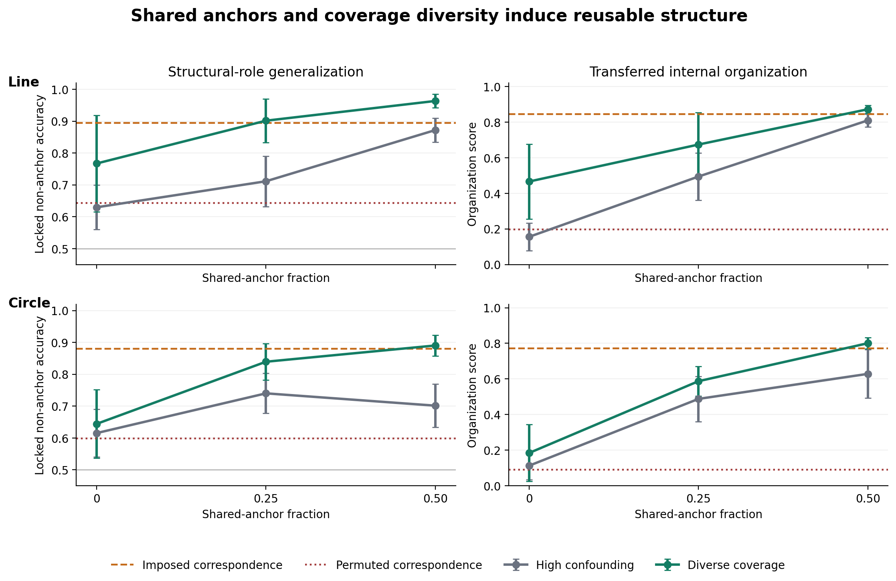

# Principle Reuse

**Training beyond benchmark mastery**

Models that perform identically on familiar validation data can still learn
very different solutions. This repository studies whether training produces a
shared internal relation that can be reused across new renderings, domain
combinations, and latent cases—not merely whether the model returns correct
answers on the distribution used to establish mastery.



The current public release adds **V9-B**, a prospective locked confirmation
that comparable organization can emerge from ordinary data structure rather
than a privileged correspondence loss. The preceding V8 factorial identifies
semantic correspondence as the active component of structural supervision;
V9 asks whether shared lexical anchors and broader context coverage can induce
the same kind of organization using ordinary task labels alone. V2 and Task 2
remain as independent demonstrations of the mastery--reuse separation.

## How the experiment works

The first task has a deliberately simple hidden world: ten positions arranged
in a strict order. Six disjoint token alphabets give those positions different
names. Two logically equivalent grammars express each comparison as `x LT y` or
`y GT x`. The principle to be reused is the same ordered relation across all of
these surface systems. The second task asks whether the result survives a more
compositional calculation, `a - b > c - d`, expressed in two equivalent
grammars over the same kind of disjoint alphabets.

Training contains every alphabet, grammar, token, label, and relevant kind of
comparison, but not every *combination* of them. Of the twelve possible
alphabet–grammar combinations, eight are used for training, two are reserved
for development, and two are kept locked. A locked combination therefore joins
a familiar alphabet to a familiar grammar in a way the model has never seen.
Latent item pairs—or, in Task 2, quadruples—are also withheld in every
rendering. This creates separate tests of a new rendering, a new latent case,
and both shifts together.

Ordinary validation draws fresh cases from the same combinations and relation
support as training, so it measures mastery without answering the broader
generalization question.

Every objective receives the same paired examples, answer labels, number of
forward passes, and optimization budget. What differs is the learning signal:

- **Concrete:** binary answer loss only.
- **Output invariant:** answer loss plus agreement between predictions for two
  renderings of the same latent query.
- **Structural auxiliary:** output invariance plus hidden-state alignment,
  signed rank-gap supervision, and alignment of the rank map across alphabets.

The structural objective deliberately reveals the certified correspondence
among renderings. It is used as a positive-control intervention: if this signal
changes later generalization while familiar validation performance is held
fixed, training has selected a differently organized solution.

Models are evaluated at eleven checkpoints. Alongside accuracy and Brier skill,
the study tests whether a source-fitted latent probe transfers without refitting,
whether alphabet-specific rank directions align, and whether a source-identified
direction can causally change predictions in a held-out rendering. This makes it
possible to compare behavioral reuse, represented structure, and causal use as
they develop after task mastery.

## Main results

### V9-B: reusable organization emerges from data structure

V9 trains width-64, two-block transformers from scratch on two latent
geometries: a line and a circle. Each task has eight lexicons and four
equivalent grammars. Six ordinary-label arms cross shared-anchor fraction
(`0`, `0.25`, `0.50`) with high-confound or diverse lexicon--grammar coverage.
Two controls impose either the correct semantic correspondence or a different
incorrect permutation in every lexicon.

The primary evaluation contains none of the six possible anchor entities.
Shared tokens therefore cannot solve it directly: any benefit must propagate
from the anchored items to the unshared vocabulary and then across a novel
structural role.

The original V9-A gate stopped because one of 192 models had source accuracy
0.892 at the interim 15,000-update checkpoint. It subsequently reached 0.986
accuracy and 0.966 Brier skill at update 20,000, and all 192 endpoint models
satisfied source mastery and the registered between-arm equivalence margins.
V9-A remains formally stopped. V9-B was registered afterward, froze all 192
existing endpoints without retraining or exclusion, and evaluated a newly
salted locked instance under a published commit--reveal protocol.

The complete registered hierarchy returned **`emergence-supported`** on both
scaffolds:

| Locked H-lock-s contrast | Line | Circle |
|---|---:|---:|
| A50 + diverse minus no-anchor/high-confound accuracy | +0.334 [+0.264, +0.403] | +0.275 [+0.203, +0.347] |
| A50 + diverse minus baseline organization | +0.717 [+0.633, +0.800] | +0.688 [+0.611, +0.764] |
| A50 minus A0 within diverse coverage | +0.196 [+0.054, +0.339] | +0.246 [+0.146, +0.346] |
| Imposed correspondence minus baseline accuracy | +0.265 [+0.155, +0.375] | +0.264 [+0.147, +0.382] |

Every primary behavioral and organization contrast was positive in all 24
scaffold--seed pairs. The primary arm's causal interchange gate was valid in
12/12 seeds on each scaffold, versus 1/12 for each baseline. Correctly induced
organization reached or exceeded the imposed-correspondence control
descriptively, while the permuted control remained near baseline.

The factorial secondary results sharpen the interpretation. Diversity at 50%
anchors was beneficial on both line (+0.091) and circle (+0.189), whereas
diversity without anchors was inconclusive. The evidence therefore supports
anchors as the principal semantic bridge, with diverse coverage helping that
alignment propagate; it does not establish that diversity alone is sufficient.

See the [V9-B protocol](experiments/training_axes/V9B_PROTOCOL.md),
[outcome-free endpoint freeze](experiments/training_axes/V9B_PREUNLOCK_REPORT.md),
[locked report](experiments/training_axes/V9B_LOCKED_REPORT.md), and
[machine-checkable release verifier](experiments/training_axes/verify_released_v9b.py).

### V8: semantic correspondence selects the reusable solution

V8 uses new token permutations, latent holdouts, evaluation seeds, and rotated
development and locked alphabets. It crosses three components of the structural
objective as a complete factorial:

- **E:** correct item-embedding correspondence across alphabets;
- **H:** final-hidden-state matching across paired renderings; and
- **G:** a shared signed-gap readout.

It also includes concrete, invariant-only, permuted-correspondence, and
alphabet-specific-readout controls. All 264 configurations satisfy the
registered source-mastery gate. Full, E-only, and H+G models are equivalent to
the invariant baseline on source accuracy, Brier skill, overall log loss, and
near-margin log loss.

The independently locked results localize the generalization effect:

| Locked combination contrast | Order | Differences |
|---|---:|---:|
| Full minus invariant-only | +0.565 [+0.389, +0.741] | +0.497 [+0.275, +0.718] |
| E-only minus full | -0.057 [-0.087, -0.027] | +0.008 [+0.001, +0.015] |
| H+G without E minus invariant-only | -0.018 [-0.137, +0.101] | +0.091 [-0.218, +0.401] |
| Permuted E minus valid E-only | -0.514 [-0.655, -0.373] | -0.314 [-0.479, -0.148] |

The registered route is **`embedding-tying-dominates`**. Correct semantic
correspondence is the only component with a clear marginal effect across both
tasks. Hidden matching contributes no detectable increment. E-only is already
strong; descriptively, E+G is the smallest objective that matches the full
objective on both tasks. The permuted control shows that generic tying or
regularization does not explain the result.

This is a controlled solution-selection result, not a claim of spontaneous
abstraction: E supplies privileged cross-rendering correspondence. See the
[V8 protocol](experiments/training_axes/V8_PROTOCOL.md),
[pre-unlock report](experiments/training_axes/V8_PREUNLOCK_REPORT.md),
[locked report](experiments/training_axes/V8_LOCKED_REPORT.md), and
[post-lock assessment](experiments/training_axes/V8_LOCKED_ASSESSMENT.md).

### Original locked studies

The release also contains the original 486 completed small-transformer runs
across two registered experiments. V2 trained 324 models in a fully crossed
design:

- three objectives: concrete answer supervision, output invariance, and
  structural auxiliary supervision;
- two weight-decay levels;
- three evidence-difficulty regimes;
- three model widths; and
- six paired random seeds.

All objective groups reached identical endpoint in-distribution validation
accuracy and Brier skill. They diverged sharply on an independently locked
deployment evaluation:

| Endpoint accuracy | Concrete | Output invariant | Structural auxiliary |
|---|---:|---:|---:|
| In-distribution validation | 1.000 | 1.000 | 1.000 |
| New domain combination | 0.434 | 0.432 | 0.919 |
| New latent relation | 0.837 | 0.841 | 0.916 |
| Both shifts | 0.465 | 0.455 | 0.865 |

The registered structural-auxiliary versus concrete contrast on new domain
combinations was +0.485 accuracy (six-seed 95% t interval: +0.387 to +0.583).
All six seed contrasts were positive, as were 107 of 108 matched factorial
cells. The difference developed primarily after ordinary validation mastery and
was accompanied by transferred latent probes, rank-axis alignment, and a much
higher rate of valid causal interchange measurements.

Task 2 then removed the weight-decay factor, retained the three objectives,
difficulties, widths, and six paired seeds, and changed the computation from
direct order to comparison of two differences. It independently reproduced the
same mastery--reuse separation:

| Task 2 endpoint accuracy | Concrete | Output invariant | Structural auxiliary |
|---|---:|---:|---:|
| In-distribution validation | 1.000 | 1.000 | 1.000 |
| New domain combination | 0.452 | 0.443 | 0.919 |
| New latent quadruple | 0.970 | 0.970 | 0.992 |
| Both shifts | 0.449 | 0.440 | 0.917 |

The registered Task 2 contrast on new domain combinations was +0.467 accuracy
(six-seed 95% t interval: +0.370 to +0.564). Every seed-level contrast was
positive, as were 50 of 54 matched factorial cells. The independently locked
effect was statistically indistinguishable from the frozen development effect.
At first persistent validation mastery, the same contrast was already +0.112;
it then grew more than fourfold by the fixed endpoint while validation remained
saturated.

Across both tasks, output agreement alone does not reproduce the structural
effect. Structural auxiliary supervision supplies privileged information and is
a positive-control intervention, not evidence of spontaneous abstraction or a
general solution to alignment. The result establishes a narrower point:
benchmark mastery does not identify the reusable organization produced by
training.

## Reproduce the released analysis

The analysis uses the committed checkpoint-level results and does not require a
GPU or PyTorch.

```bash
python3 -m venv .venv
source .venv/bin/activate
pip install -r requirements-analysis.txt

python -m experiments.training_axes.task
python -m experiments.training_axes.analyze_locked_v2
python -m experiments.training_axes.analyze_locked_task2
python -m experiments.training_axes.verify_released_v8
python -m experiments.training_axes.verify_released_v9b
python -m experiments.training_axes.plot_cross_task
python -m experiments.training_axes.plot_v9b
```

These commands regenerate:

- `experiments/training_axes/v2_locked_cells.csv`;
- `experiments/training_axes/v2_locked_contrasts.json`;
- `experiments/training_axes/V2_LOCKED_REPORT.md`;
- the corresponding Task 2 locked cells, contrasts, and report; and
- verification and complete recomputation of the released V8 locked analysis;
- validation of the V8 development, diagnostic, and locked result-tree hashes;
- complete recomputation of the V9 source gates and prospective locked
  analysis, including the public commit--reveal check; and
- `assets/cross_task_overview.*` and `assets/v9b_emergence.*`.

See [REPRODUCING.md](REPRODUCING.md) for the end-to-end training and locked-test
workflow. See [DATA_CARD.md](DATA_CARD.md) for the split definitions, file
inventory, scope, and limitations.

## Study integrity

The data roles and estimands were recorded before the locked evaluation. The
repository includes:

- the [validation and generalization protocol](experiments/training_axes/V2_VALIDATION_PROTOCOL.md);
- the [pre-unlock report](experiments/training_axes/V2_PREUNLOCK_REPORT.md);
- the [locked deployment report](experiments/training_axes/V2_LOCKED_REPORT.md);
- the exact [V2 manifest](experiments/training_axes/v2_manifest.csv);
- all 324 development trajectories in
  `experiments/training_axes/results_v2/`; and
- all 324 locked trajectories in
  `experiments/training_axes/locked_results_v2/`;
- the [Task 2 protocol](experiments/training_axes/TASK2_PROTOCOL.md),
  [pre-unlock freeze](experiments/training_axes/TASK2_PREUNLOCK_FREEZE.md), and
  [locked report](experiments/training_axes/TASK2_LOCKED_REPORT.md); and
- all 162 Task 2 development and 162 locked trajectories.

For V8 it also includes:

- the [registered protocol](experiments/training_axes/V8_PROTOCOL.md) and exact
  264-run [manifest](experiments/training_axes/v8_manifest.csv);
- the [development freeze](experiments/training_axes/V8_PREUNLOCK_REPORT.md) and
  machine-readable `v8_preunlock_freeze.json`;
- all 264 development trajectories, 264 gradient-diagnostic trajectories, and
  264 locked trajectories;
- the [registered locked report](experiments/training_axes/V8_LOCKED_REPORT.md)
  and machine-readable `v8_locked_analysis.json`; and
- `verify_released_v8.py`, which recomputes every released locked statistic
  without requiring the unreleased model checkpoints.

For V9 it includes:

- the original [V9-A protocol](experiments/training_axes/V9_PROTOCOL.md), its
  stopped [development report](experiments/training_axes/V9_PREUNLOCK_REPORT.md),
  and machine-readable `v9_preunlock_freeze.json`;
- the prospective [V9-B protocol](experiments/training_axes/V9B_PROTOCOL.md),
  [endpoint freeze](experiments/training_axes/V9B_PREUNLOCK_REPORT.md), and
  [locked report](experiments/training_axes/V9B_LOCKED_REPORT.md);
- all 192 fourteen-checkpoint development trajectories and all 192 locked
  endpoint rows;
- the precommitted lock digest and post-evaluation reveal; and
- `verify_released_v9b.py`, which reconstructs the source gates and every
  locked statistic without the unreleased model checkpoints.

The V2 manifest SHA-256 recorded before unlock is
`69651ec8f7129706b0dd4730921657a4ea028e9ad33e414f1b5c3c152d3497ed`.
The corresponding Task 2 digest is
`8bed6bf9ebf1a5779d60c348f79b90997b450305cc36de2226b6009c043feaec`.
Run `shasum -a 256` on either manifest to verify it.

## Repository map

```text
assets/                              Public-facing result figure
experiments/panel/model.py           Addressable transformer implementation
experiments/training_axes/task.py    Ordered-relation generator and locked splits
experiments/training_axes/run.py     One-cell training entry point
experiments/training_axes/metrics.py Structural and causal measurements
experiments/training_axes/design_v2.py
experiments/training_axes/analyze_locked_v2.py
experiments/training_axes/results_v2/
experiments/training_axes/locked_results_v2/
experiments/training_axes/task_differences.py
experiments/training_axes/design_task2.py
experiments/training_axes/analyze_locked_task2.py
experiments/training_axes/results_task2/
experiments/training_axes/locked_results_task2/
experiments/training_axes/task_v8.py
experiments/training_axes/design_v8.py
experiments/training_axes/analyze_v8_common.py
experiments/training_axes/verify_released_v8.py
experiments/training_axes/results_v8/
experiments/training_axes/locked_results_v8/
experiments/training_axes/task_v9.py
experiments/training_axes/design_v9.py
experiments/training_axes/V9B_PROTOCOL.md
experiments/training_axes/verify_released_v9b.py
experiments/training_axes/results_v9/
experiments/training_axes/locked_results_v9b/
```

## Scope

This release supports claims about controlled synthetic tasks and small
transformers. It establishes that correct semantic correspondence can select a
reusable solution within a tightly matched source-performance fiber, and that
shared anchors plus coverage diversity can induce similar organization from
ordinary task labels. It does **not** establish unconstrained spontaneous
principle discovery, generality across natural-language tasks, asymptotic
separation rather than faster development, irreversible path dependence, or
normative alignment. Those are follow-up questions.

## Citation

A paper citation will be added when the public preprint is posted. In the
meantime, please cite this repository by title and archived release identifier.

## License

The software and documentation are released under the [MIT License](LICENSE).
The result files may be reused with attribution to the project.
